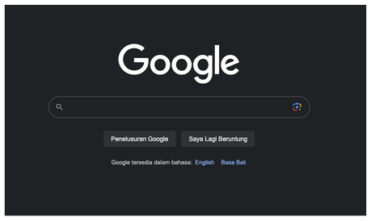
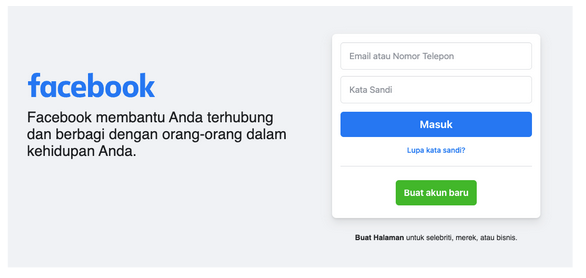

# HTML FORM

## Table Of Contents

- [Pengenalan HTML Form](#pengenalan-html-form)
- [Form Tag](#form-tag)
- [Input Tag](#input-tag)
- [Input Text](#input-text)
- [Label Tag](#label-tag)
- [Input Submit](#input-submit)
- [Memproses Input](#memproses-input)
- [Input Reset](#input-reset)
- [Input Button](#input-button)
- [Input Checkbox](#input-checkbox)
- [Input Color](#input-color)
- [Input Date](#input-date)
- [Input Data Time](#input-data-time)
- [Input Month](#input-month)
- [Input Time](#input-time)
- [Input Week](#input-week)
- [Input Email](#input-email)
- [Input File](#input-file)
- [Input Hidden](#input-hidden)
- [Input Image](#input-image)
- [Input Number](#input-number)
- [Input Password](#input-password)
- [Input Radio](#input-radio)
- [Input Range](#input-range)
- [Input Telephone](#input-telephone)
- [Input URL](#input-url)
- [Text Area Tag](#text-area-tag)
- [Button Tag](#button-tag)
- [Select Tag](#select-tag)
- [Data List Tag](#data-list-tag)
- [Field Set Tag](#field-set-tag)

## Penganalan HTML Form

- Jika kita perhatikan halaman web yang populer seperti Google, Facebook dan Youtube
- Semua web tersebut memiliki bagian untuk menerima data, yang datanya dimasukkan oleh pengguna web tersebut
- Di HTML, untuk menerima input data dari pengguna, kita bisa menggunakan HTML Form
- Terdapat banyak sekali jenis input data yang bisa kita buat dalam Form, seperti teks, checkbox, selection, password, dan masih banyak yang lainnya

**Contoh Form Google:**



**Contoh Form Facebook:**



## Form Tag

- Form Tag adalah tag dengan kata kunci `form`, yang digunakan sebagai bagian dari input informasi yang diberikan oleh pengguna
- Setiap kita ingin membuat input informasi dari pengguna, maka kita harus buat dalam Form Tag

**Kode Form Tag:**

```html
<!DOCTYPE html>
<html lang="en">
  <head>
    <meta charset="UTF-8" />
    <meta name="viewport" content="width=device-width, initial-scale=1.0" />
    <title>Belajar Form</title>
  </head>
  <body>
    <form>
      <!-- isi form -->
    </form>
  </body>
</html>
```

**Form Attribute**

- Form Tag memiliki banyak atribut, berikut adalah atribut yang penting untuk kita ketahui
- `name`, berisi informasi nama form, nama form harus unik dalam satu file html, tidak boleh ada nama form yang sama
- `action`, berisi URL (bisa absolute atau relative) kemana informasi di form ini akan dikirim
- `enctype`, berisi tipe data form, defaultnya `“application/x-www-form-urlencoded”`, atau `“multipart/form-data”` jika input data berisi file
- method, berisi aksi HTTP Method yang akan digunakan, jika `“get”` maka informasi akan dikirim sebagai query parameter di URL, jika “post” maka informasi akan dikirim di request body HTTP
- `target`, berisikan informasi dimana hasil form ini akan ditampilkan, defaultnya adalah `“_self”` (dihalaman yang sama), atau `“_blank”` (di halaman berbeda)

**Kode Form Attribute:**

```html
<form
  action="form-submit.html"
  method="POST"
  name="contoh"
  enctype="application/x-www-form-urlencoded"
  target="_blank"
>
  <!-- isi form -->
</form>
```

## Input Tag

- Form Tag hanya deklarasi bahwa kita akan membuat form berisi input data
- Sedangkan untuk detail input data apa yang diperlukan, kita perlu menggunakan Input Tag
- Input tag menggunakan kata kunci `“input”`

**Input Attribute**

- HTML Form mendukung banyak sekali jenis input, dan untuk mengatur jenis input, kita harus mengubahnya menggunakan attribute. Ada beberapa attribute yang perlu kita ketahui di input
- `name`, digunakan untuk memberi nama input, nama input harus unik dalam form yang sama, tidak boleh ada yang sama
- `type`, digunakan untuk memilih jenis input, kita akan bahas lebih detail untuk jenis-jenis tipe input yang tersedia di HTML
- `value`, digunakan untuk mengubah nilai default dari input
- `disabled`, digunakan untuk menjadikan input tidak aktif
- `readonly`, digunakan untuk menjadikan input tidak bisa diubah
- `required`, digunakan untuk menandai bahwa input wajib diisi

**Kode Input:**

```html
<form
  action="form-submit.html"
  method="POST"
  name="contoh"
  enctype="application/x-www-form-urlencoded"
  target="_blank"
>
  <input type="text" name="pencarian" />
</form>
```

## Input Text

- Input type dengan nilai text, digunakan untuk membuat input data text / tulisan / string
- Input Text ditampilkan dalam bentuk input satu baris, oleh karena itu kita tidak bisa menambahkan karakter ENTER pada Input Text
- Input Text cocok untuk jenis input data text yang memang tidak lebih dari baris, artinya tidak membutuhkan karakter ENTER

**Kode Input Text:**

```html
<form name="registrasi">
  Nama : <br />
  <input type="text" name="nama" /> <br />
  Email : <br />
  <input type="text" name="email" /> <br />
  Telepon : <br />
  <input type="text" name="telepon" />
</form>
```

## Label Tag

- Saat kita membuat caption untuk input, direkomendasikan menggunakan Label, dibanding menggunakan teks polos atau tag seperti `span` / `p` / `div`
- Label Tag bisa dikaitkan dengan input, sehingga ketika kita mengklik tulisan pada Label, secara otomatis fokus akan berpindah ke Input
- Selain itu, saat mengaktifkan Screen Reader, ketika kita mengklik Input, secara otomatis Label yang terasosiasi dengan Input tersebut akan dibaca oleh Screen Reader
- Label memiliki attribute `“for”` yang digunakan untuk menentukan Input `Id` yang dipilih untuk diasosiasikan

**Kode Label Tag:**

```html
<form name="registrasi">
  <label for="nama">Nama :</label> <br />
  <input type="text" name="nama" id="nama" /> <br />
  <label for="email">Email :</label> <br />
  <input type="text" name="email" id="email" /> <br />
  <label for="telepon">Telepon: </label> <br />
  <input type="text" name="telepon" id="telepon" /> <br />
</form>
```

## Label Submit

- Saat membuat Form, kita bisa menambahkan tombol yang bisa digunakan untuk mengirim data yang diinputkan di dalam form, atau disebut Submit
- Tombol Submit, bisa kita buat menggunakan Input dengan type `Submit`

**Kode Label Submit:**

```html
<form name="registrasi">
  <label for="nama">Nama :</label> <br />
  <input type="text" name="nama" id="nama" /> <br />
  <label for="email">Email :</label> <br />
  <input type="text" name="email" id="email" /> <br />
  <label for="telepon">Telepon: </label> <br />
  <input type="text" name="telepon" id="telepon" /> <br />
  <input type="submit" value="Registrasi" />
</form>
```

## Memproses Input

**Form Action**

- Seperti yang di materi sebelumnya dibahas, untuk mengirim data di form, kita harus tentukan kemana semua input data akan dikirim menggunakan attribute “action” pada form
- Kita juga bisa menentukan jenis method, baik itu `“get”` atau `“post”` ketika mengirim input data

**Kode Form Action:**

```html
<form name="registrasi" action="receive.html" method="GET">
  <label for="nama">Nama :</label> <br />
  <input type="text" name="nama" id="nama" /> <br />
  <label for="email">Email :</label> <br />
  <input type="text" name="email" id="email" /> <br />
  <label for="telepon">Telepon: </label> <br />
  <input type="text" name="telepon" id="telepon" /> <br />
  <input type="submit" value="Registrasi" />
</form>
```

**Memproses Input**

- Untuk memproses Input, kita harus menggunakan teknologi berbasis server di Web Server
- HTML adalah halaman web yang di tampilkan di client (Web Browser), sehingga HTML tidak bisa digunakan untuk memproses input data dari form
- Untuk memproses data, kita harus menggunakan teknologi berbasis server, misal contohnya adalah PHP, NodeJS, Java, dan masih banyak yang lainnya

## Input Reset

- Input dengan type reset, adalah input yang akan ditampilkan dalam bentuk tombol
- Jika tombol reset tersebut di klik, maka seluruh input di form tersebut, nilainya akan berubah menjadi nilai default seperti yang terdapat di attribute value nya

**Kode Input Reset:**

```html
<form name="registrasi" action="receive.html" method="GET">
  <label for="nama">Nama :</label> <br />
  <input type="text" name="nama" id="nama" /> <br />
  <label for="email">Email :</label> <br />
  <input type="text" name="email" id="email" /> <br />
  <label for="telepon">Telepon: </label> <br />
  <input type="text" name="telepon" id="telepon" /> <br />
  <input type="reset" value="Reset" />
  <input type="submit" value="Registrasi" />
</form>
```

## Input Button

- Membuat tombol tidak hanya bisa menggunakan input type `submit` atau `reset`, kita juga bisa menggunakan input type `button`
- Namun, menggunakan input type `button` tidak terlalu berguna jika hanya menggunakan HTML
- Biasanya, pembuat web akan menambahkan interaksi terhadap tombol tersebut menggunakan kode JavaScript (yang bisa dipelajari setelah belajar HTML dan CSS)

**Kode Input Button:**

```html
<form>
  <input type="button" value="Hello" onclick="alert('Hello')" />
  <input type="button" value="World" onclick="alert('World')" />
</form>
```

## Input Checkbox

- Checkbox adalah input dengan tipe ceklis, dimana kita bisa menceklis atau tidak menceklis input tersebut
- Biasanya, Checkbox digunakan untuk menerima input lebih dari satu, namun inputnya sudah disesuaikan

```html
<form>
  Hobby : <br />

  <input type="checkbox" name="Hobby" id="masak" value="Masak" />
  <label for="masak">Masak</label>

  <input type="checkbox" name="Hobby" id="menggambar" value="menggambar" />
  <label for="menggambar">menggambar</label>

  <input type="checkbox" name="Hobby" id="membaca" value="Membaca" />
  <label for="membaca">Membaca</label>
</form>
```

## Input Color

- Input type `color` adalah type untuk menerima input warna
- Warna di HTML akan ditulis dalam bentuk hex code
- Contohnya kita bisa lihat daftar hex code warna disini : `https://www.color-hex.com/`

**Kode Input Color:**

```html
<form>
  <label for="favorite">Warna Kesukaan: </label>
  <input type="color" name="favorite" id="favorite" value="#000fff" />
</form>
```

## Input Date

- Input type `date`, adalah jenis input untuk menerima informasi berupa tanggal (tahun, bulan dan tanggal)
- Jika kita ingin mengubah nilai value di input type date, kita bisa menggunakan format `yyyy-mm-dd`
- `yyyy` adalah tahun dalam 4 digit
- `mm` adalah bulan dalam 2 digit
- `dd` adalah tanggal dalam 2 digit
- Untuk membatasi minimal dan maksimal tanggal yang dipilih, kita bisa gunakan atribut `min` dan `max`

**Kode Input Date:**

```html
<form>
  <label for="join_date">Tanggal Masuk: </label>
  <input type="date" name="join_date" id="join_date" value="2023-11-3" />
</form>
```

## Input Date Time

- Jika untuk input tanggal bisa menggunakan type date, jika kita butuh sampai ke menit, kita bisa menggunakan Input Date Time, yaitu menggunakan type `datetime-local`
- Format value untuk Date Time adalah `yyyy-mm-ddThh:mm`
- Dimana tanggal dan waktu dipisah oleh karakter `T`
- `hh` adalah jam dalam format 2 digit
- `mm` adalah menit dalam format 2 digit
- Untuk membatasi minimal dan maksimal waktu yang dipilih, kita bisa gunakan atribut `min` dan `max`

**Kode Input Date Time:**

```html
<form>
  <label for="jam_masuk">Tanggal Masuk: </label>
  <input
    type="datetime-local"
    name="jam_masuk"
    id="jam_masuk"
    value="2023-11-03T06:00"
  />
</form>
```

## Input Month

- Input type `month` digunakan untuk input informasi berupa tahun dan bulan
- Format value untuk input type month adalah `yyyy-mm`
- `yyyy` adalah 4 digit tahun
- `mm` adalah 2 digit bulan
- Untuk membatasi minimal dan maksimal bulan yang dipilih, kita bisa gunakan atribut `min` dan `max`

**Kode Input Month:**

```html
<form>
  <label for="expired">Bulan Kadaluarsa: </label>
  <input type="month" name="expired" id="expired" value="2023-10" />
</form>
```

## Input Time

- Jika kita hanya membutuhkan informasi jam dan menit, kita bisa menggunakan input type `time`
- Input type `time` menggunakan format `hh:mm`
- `hh` adalah jam dalam 2 digit
- `mm` adalah menit dalam 2 digit
- Untuk membatasi minimal dan maksimal waktu yang dipilih, kita bisa gunakan atribut `min` dan `max`

**Kode Input Time:**

```html
<form action="">
  <label for="jam_masuk">Jam Masuk: </label>
  <input type="time" name="jam_masuk" id="jam_masuk" value="07:30" /> <br />
  <label for="jam_keluar">Jam Keluar: </label>
  <input type="time" name="jam_keluar" id="jam_keluar" value="09:00" /> <br />
  <input type="submit" value="Simpan" />
</form>
```

## Input Week

- Input type `week` digunakan untuk menerima input minggu dalam satu tahun
- Total minggu dalam satu tahun berkisar antara 52-53, artinya itu adalah maksimal nilai untuk week
- Format penulisan week bisa menggunakan pola `yyyy-Www`
- `yyyy` adalah tahun dalam 4 digit
- `ww` adalah minggu dalam 2 digit
- Untuk membatasi minimal dan maksimal minggu yang dipilih, kita bisa gunakan atribut `min` dan `max`

**Kode Input Week:**

```html
<form action="">
  <label for="waktu_mulai">Waktu Mulai: </label>
  <input type="time" name="waktu_mulai" id="waktu_mulai" value="2023:w01" />
  <br />
  <label for="waktu_selesai">Waktu Selesai: </label>
  <input type="time" name="waktu_selesai" id="waktu_selesai" value="2023:w50" />
  <br />
  <input type="submit" value="Simpan" />
</form>
```

## Input Email

- Input `email` adalah input text, namun informasi yang dimasukkan haruslah dalam format email
- Jika format email tidak benar, secara otomatis form tidak akan bisa di submit

**Kode Input Email:**

```html
<form action="receive.html">
  <label for="email">Email: </label>
  <input type="email" name="email" id="email" required /> <br />
  <input type="submit" value="Kirim" />
</form>
```

## Input File

- Input dengan type `file`, digunakan untuk meng-upload / mengunggah berkas file dari komputer kita
- Saat kita membuat input dengan type file, maka agar form mengirim berkas file-nya, kita harus gunakan method `post`, dan juga enctype `multipart/form-data`

**Kode Input File:**

```html
<form action="receive.html" method="POST" enctype="multipart/form-data">
  <label for="profile">Gambar Profile: </label>
  <input type="file" name="profile" id="profile" /> <br />
  <input type="submit" value="Kirim" />
</form>
```

## Input Hidden

- Di HTML, terdapat fitur input type `hidden`
- Input type hidden artinya input datanya tidak terlihat oleh pengguna Web
- Biasanya input data hidden memang tidak dimaksudkan untuk diinputkan oleh pengguna, biasanya pada kasus-kasus tertentu input data hidden digunakan untuk informasi yang dibuat secara otomatis oleh web kita, dan tidak butuh diubah atau dilihat oleh pengguna
- Misal saat saya mengubah nama pengguna, kita juga mungkin harus tahu user_id dari pengguna, namun kita tidak mau user_id bisa diubah oleh pengguna, kita bisa menggunakan input type hidden untuk user_id nya

**Kode Input Hidden:**

```html
<form action="">
  <input type="hidden" name="user_id" value="otong" />
  <label for="nama">Nama: </label>
  <input type="text" name="nama" id="nama" /><br />
  <input type="submit" value="Simpan" />
</form>
```

## Input Image

- Input type `image` bukan digunakan untuk input berupa berkas gambar, melainkan digunakan untuk membuat tombol submit namun berupa gambar
- Input type `button`, `submit` atau `reset` menggunakan text untuk tombolnya, sedangkan image menggunakan gambar yang bisa kita ubah menggunakan atribut `src`
- Misal : *https://interactive-examples.mdn.mozilla.net/media/examples/login-button.png*

**Kode Input Image:**

```html
<form action="">
  <input type="hidden" name="user_id" value="otong" />
  <label for="nama">Nama: </label>
  <input type="text" name="nama" id="nama" /><br />
  <input
    type="image"
    src="https://interactive-examples.mdn.mozilla.net/media/examples/login-button.png"
    alt="Mozilla"
  />
  <input type="submit" value="Simpan" />
</form>
```

## Input Number

- Input type `number` adalah input untuk informasi number atau angka
- Jika kita menginputkan bukan number atau angka, secara otomatis HTML menganggap nilainya tidak valid
- Untuk input type number, kita bisa gunakan atribut tambahkan yaitu `min` dan `max`
- `min` digunakan untuk mengatur nilai minimal
- `max` digunakan untuk mengatur nilai maksimal

**Kode Input Number:**

```html
<form action="">
  <label for="nilai_ujian">Nilai Ujian: </label>
  <input
    type="number"
    name="nilai_ujian"
    id="nilai_ujian"
    min="0"
    max="100"
    value="0"
  />
  <input type="submit" value="Simpan" />
</form>
```

## Input Password

- Input type `password` adalah input untuk informasi teks sama seperti input type text, namun pada input type password, karakter akan di masking (tidak ditampilkan)
- Input type password sangat cocok untuk input teks yang rahasia, sehingga tidak bisa diintip oleh orang lain

**Kode Input Password:**

```html
<form action="" method="POST">
  <label for="email">Email: </label>
  <input type="email" name="email" id="email" /> <br />
  <label for="password">Password: </label>
  <input type="password" name="password" id="password" /> <br />
  <input type="submit" value="Masuk" />
</form>
```

## Input Radio

- Input type `radio` merupakan input untuk informasi pilihan
- Pada checkbox, kita bisa memilih lebih dari satu checkbox walaupun menggunakan name yang sama
- Sedangkan pada radio, kita hanya bisa memilih salah satu saja radio pada input name yang sama
- Input ini cocok untuk input data pilihan ganda misalnya

**Kode Input Radio:**

```html
<form action="">
  Budi memiliki uang 20.000, dibelikan coklat 5.000, sisa uangnya adalah <br />
  <input type="radio" name="jawaban" id="jawaban1" />
  <label for="jawaban1">10.000</label> <br />
  <input type="radio" name="jawaban" id="jawaban2" />
  <label for="jawaban2">15.000</label> <br />
  <input type="radio" name="jawaban" id="jawaban3" />
  <label for="jawaban3">12.000</label> <br />
  <input type="radio" name="jawaban" id="jawaban4" />
  <label for="jawaban4">8.000</label> <br />
</form>
```

## Input Range

- Input type `range` adalah input untuk number / angka namun ditentukan jangkauan minimal dan minimal nya
- Ini mirip seperti input number, yang membedakan adalah, bentuk komponen inputnya tidak seperti input text, melainkan dalam bentuk slider, yang bisa di slide ke kiri untuk menurunkan nilai dan ke kanan untuk menaikkan nilai
- Secara default, nilai range naik bertahap sebanyak +1 atau berkurang sebanyak -1, namun jika kita ingin mengubah nilai naik dan turun nya, kita bisa tambahkan atribute step

**Kode Input Range:**

```html
<form action="">
  <label for="nilai_ujian">Nilai Ujian: </label>
  <input
    type="range"
    name="nilai_ujian"
    id="nilai_ujian"
    min="0"
    max="100"
    value="50"
    step="10"
  />
</form>
```

## Input Telephone

- Input type `tel` bisa digunakan untuk input informasi telepon
- Namun berbeda dengan input email atau number, aturan di input tel harus kita tentukan sendiri, hal ini karena format telepon di tiap negara berbeda-beda
- Kita bisa mengubah aturan format nomor telepon menggunakan atribut pattern, dimana isinya harus berisi Regular Expression
- Materi Regular Expression akan dipelajari di kelas JavaScript, namun disini kita bisa mencoba-coba menggunakan website :
  *https://regexr.com/*

**Kode Input Telephone:**

```html
<form action="">
  <label for="telepon">Telepon: </label>
  <input type="tel" name="telepon" id="telepon" pattern="(62)[0-9]{5,20}" />
  <input type="submit" value="Simpan" />
</form>
```

## Input URL

- Input type `url` digunakan untuk menerima input data dalam bentuk URL, seperti alamat website pribadi, website social media, dan lain-lain
- Jika format url tidak valid, maka HTML tidak akan menerima input data url tersebut

**Kode Input URL:**

```html
<form action="">
  <label for="website">Website: </label>
  <input type="url" name="website" id="website" /> <br />
  <input type="submit" value="Simpan" />
</form>
```

## Text Area Tag

- HTML juga menyediakan tag `textarea`, yang bisa digunakan untuk input text yang multi baris
- Untuk menentukan panjang input, kita bisa gunakan atribut `cols`, dan untuk menentukan tinggi input, kita bisa gunakan `rows`

**Kode Text Area Tag:**

```html
<form action="">
  <label for="deskripsi">Deskripsi: </label>
  <textarea name="deskripsi" id="deskripsi" cols="40" rows="10">
Ini isi text awal</textarea
  >
  <br />
  <input type="submit" value="Simpan" />
</form>
```

## Button Tag

- `Button` tag adalah tag yang bisa kita gunakan untuk membuat tombol
- Apa bedanya dengan input type button?
- Karena button tag memiliki content di dalam tag nya, jadi kita bisa dengan bebas menambahkan isi dari button, misal text atau gambar
- Jadi menggunakan button tag akan lebih flexible dibanding menggunakan input type button
- Button juga memiliki atribut type, yang bisa kita gunakan untuk mengubah jenis tipe button, dari mulai button (biasa), reset dan submit

**Kode Button Tag:**

```html
<form action="">
  <label for="nama">Nama: </label>
  <input type="text" name="nama" id="nama" />
  <button type="button">
    
  </button>
  <button type="reset">Reset</button>
  <button type="submit">Simpan</button>
</form>
```

## Select Tag

- `Select` tag adalah alternatif lain seperti input type radio
- Saat menggunakan input type radio, jika opsi pilihan terlalu banyak, maka tampilan input akan sangat panjang
- Select tag menawarkan solusi yang sederhana, dimana input akan seperti type text, namun kita bisa memilih opsi pilihan seperti radio type

**Option Tag**

- Untuk menambah opsi pilihan dalam select tag, kita bisa menggunakan `option` tag
- Option tag memiliki atribut value sebagai nilainya, namun untuk ditampilkan dalam Web Browser, kita bisa isi option tag dengan content misal text
- Selain itu, jika kita ingin memilih secara default salah satu option, kita bisa menggunakan atribut selected

**Kode Select Tag:**

```html
<form action="">
  <label for="hobby">Hobby: </label>
  <select name="hobby" id="hobby">
    <option value="coding" selected>Coding</option>
    <option value="drawing">Drawing</option>
    <option value="gaming">Gaming</option>
  </select>
  <button type="submit">Simpan</button>
</form>
```

> Source Material [Programmer Zaman Now](https://www.programmerzamannow.com)
